# Rocky Mountain French Bulldog Rescue Website Redesign Proposal

## Overview

This proposal focused on redesigning the Rocky Mountain French Bulldog Rescue (RMFBR) website to improve accessibility, usability, and visual design. The RMFBR is a non-profit organization dedicated to rescuing, rehabilitating, and rehoming French bulldogs, many of whom have significant medical needs. My goal was to create a more inclusive and visually pleasing website that aligns with the Web Content Accessibility Guidelines (WCAG) 2.1 standards, allowing users with visual impairments to navigate the page smoothly.

### Key Objectives
1. Enhance accessibility for visually impaired users.
2. Improve overall user experience and navigation.
3. Establish a visually uniform and appealing interface.

## Features of the Redesigned Website

- **Accessible Navigation**:
  - Added ARIA labels and a hidden "Skip Navigation" button.
  - Consolidated redundant links to streamline navigation for screen readers.
- **Improved Visual Design**:
  - Developed a high-contrast color scheme to resolve 12 instances of low contrast text.
  - Ensured text readability at 200% browser zoom.
- **Structural Enhancements**:
  - Fixed 17 instances of empty alternative text for links and images.
  - Resolved all errors detected by the Nu HTML Checker, including fixing skipped heading levels.
- **Mobile-Friendly**:
  - Ensured responsive design for mobile accessibility.

## Before and After Comparisons

### Homepage

**Before:**
---
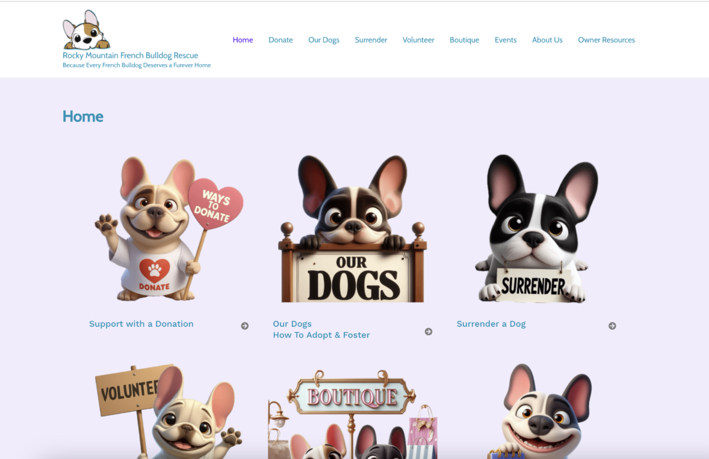  

**After:**
---
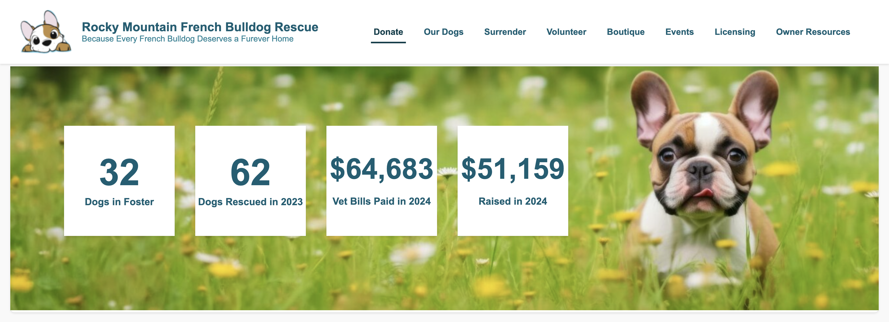 
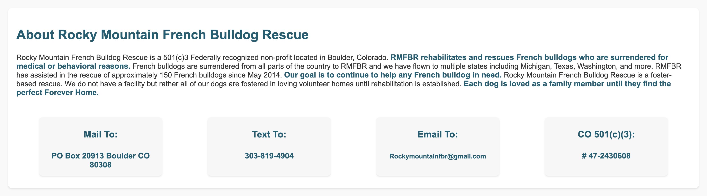  
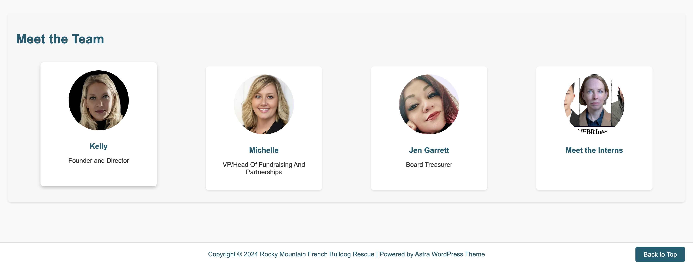

### Donate Page

**Before:**
---
  

**After:**
---
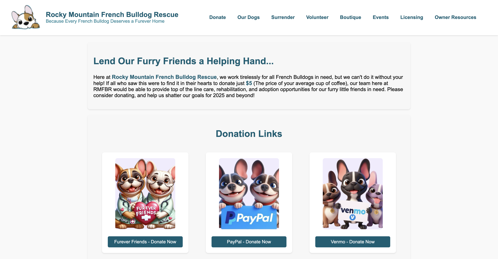  
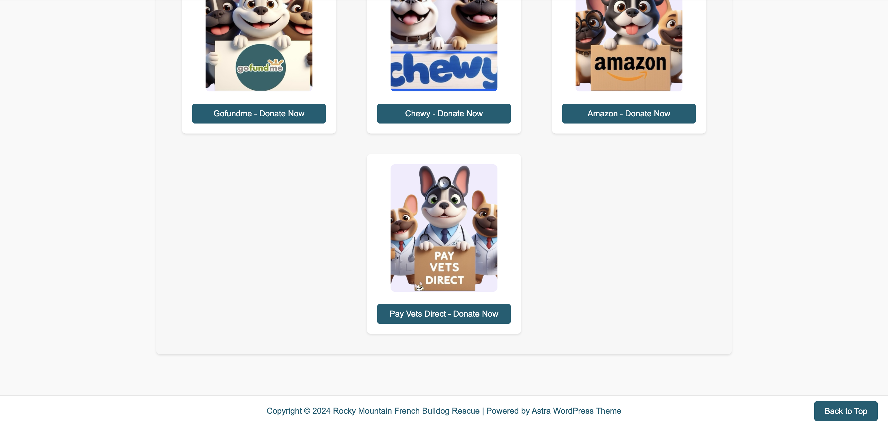  

## Highlighted Improvements

Below are five key aspects I improved upon:

1. **Low Contrast Text Fixes**  
   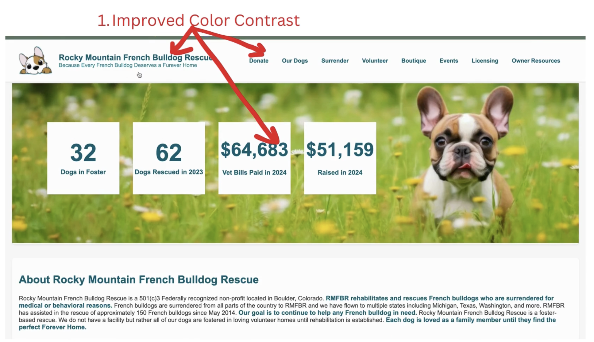

2. **Redundant Links Consolidation**  
   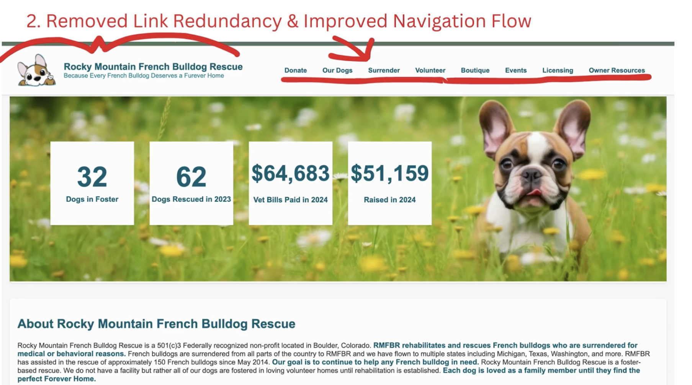

3. **Enhanced Semantic Structure**  
   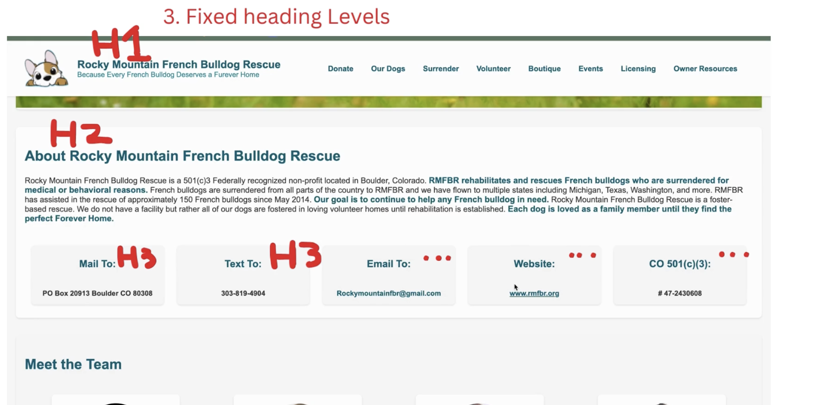

4. **Added Instances of ARIA Lebeling**  
   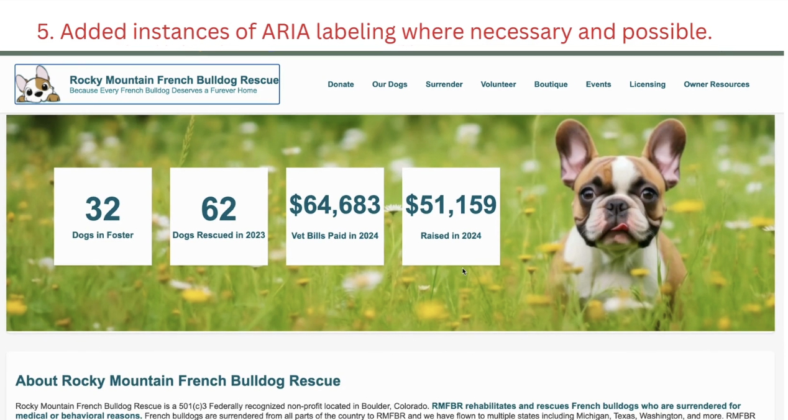

5. **Ease of Access to Essential Info**  
   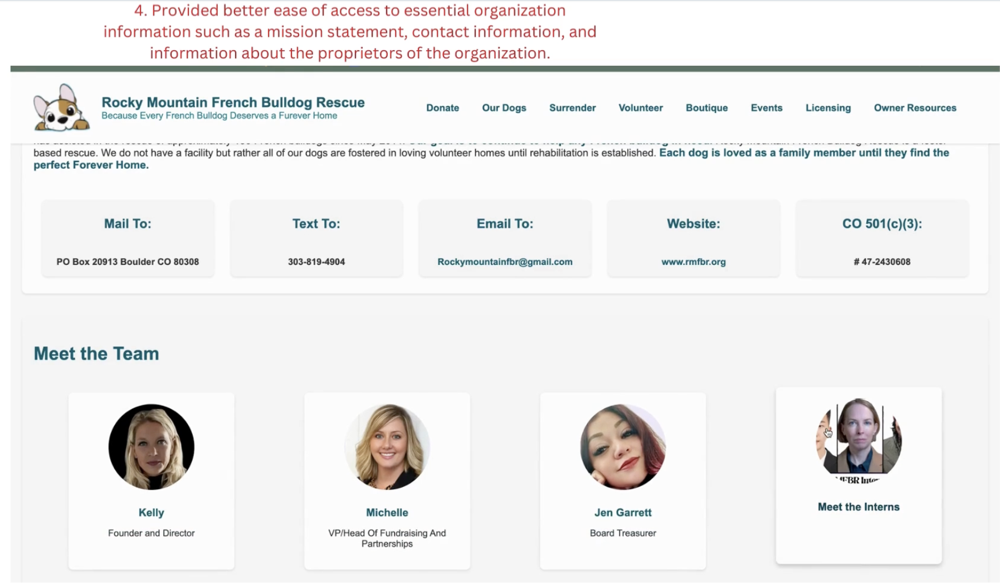

## Technical Details

The website redesign followed WCAG 2.1 guidelines and utilized modern web development practices. The improvements were identified using tools such as the WAVE Web Accessibility Tool and validated through heuristic evaluation.

### Tools and Frameworks Used:
- **Nu HTML Checker**: For identifying and fixing HTML errors.
- **WAVE Accessibility Tool**: For detecting accessibility issues.

## Feedback and Validation

We interviewed Kelly Money, the Founder and Executive Director of RMFBR, to ensure our improvements aligned with the organization’s goals. The feedback was overwhelmingly positive, noting significant enhancements in usability and accessibility.

## Live Demo

Explore the redesigned pages:  
- [Homepage](https://alexa2304.github.io/RMFBR-SiteRedesign/RMFBR-Home.html)  
- [Donate Page](https://alexa2304.github.io/RMFBR-SiteRedesign/RMFBR-Donate.html)

## License

This proposal is licensed under the [MIT License](LICENSE).
